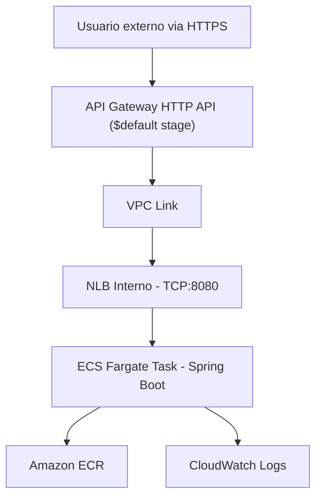

# Arquitectura de API Gateway + NLB + ECS Fargate (Privado)

Esta arquitectura implementa una API privada basada en AWS API Gateway HTTP API, VPC Link, Network Load Balancer (NLB) interno, y ECS Fargate como backend.

---

## 📐 Diagrama de Arquitectura



---

## 🚀 Orden de despliegue con CloudFormation

1. **`vpc-network.yaml`**  
   Crea:
   - VPC privada
   - Subnets privadas
   - Security Groups (para Fargate y NLB)

2. **`nlb.yaml`**  
   Crea:
   - NLB interno (TCP:8080)
   - Target Group
   - Listener
   - Outputs:
     - `NlbArn`
     - `TargetGroupArn`
     - `NlbListenerArn`

3. **`vpc-endpoints.yaml`**  
   Crea VPC Endpoints Interface para:
   - ECR (api, dkr)
   - CloudWatch Logs

4. **`public-subnets.yaml`** *(opcional / temporal)*  
   Crea subnets públicas para Fargate

5. **`ecs-fargate.yaml`**  
   Crea:
   - Servicio y tarea ECS
   - Define imagen de contenedor desde ECR
   - Conecta con el Target Group del NLB

6. **`apigateway-vpclink.yaml`**  
   Crea:
   - API Gateway HTTP API (`$default` stage)
   - VPC Link hacia el NLB
   - Ruta `ANY /accounts` integrada con listener del NLB

---

## 🌐 URL de consumo

```bash
curl -i https://<API-ID>.execute-api.us-east-1.amazonaws.com/accounts
```

- El path `/accounts` es redirigido directamente al contenedor Spring Boot.

---

## 📦 Componentes clave

| Componente         | Servicio AWS                 | Detalle                                |
|--------------------|------------------------------|----------------------------------------|
| API publica        | API Gateway HTTP API         | Usa VPC Link y `$default` stage        |
| Red privada        | VPC + Subnets + SG           | Red privada para Fargate y NLB         |
| Balanceador        | Network Load Balancer (NLB)  | Interno, listener TCP:8080             |
| Backend            | ECS Fargate + Spring Boot    | Contenedor sin IP publica              |
| Imagen             | Amazon ECR                   | Contenedor `demo-app:latest`           |
| Observabilidad     | CloudWatch Logs              | Logs del contenedor (via Log Driver)   |
| Acceso a ECR       | VPC Endpoints privados       | ECR API y Docker                       |

---

## Pasos para subir la imagen a ECR y luego ejecutar ./deploy.sh

# 1. Compila el JAR
./mvnw clean package -DskipTests

# 2. Construye la imagen Docker
docker build --platform=linux/amd64 -t demo-app .

# 3. Tag de la imagen para ECR
docker tag demo-app:latest tucuenta.dkr.ecr.us-east-1.amazonaws.com/demo-app:latest

# 4. Inicia sesion en ECR (usa el perfil correcto si lo necesitas)
aws ecr get-login-password --region us-east-1 --profile tuperfil \
  | docker login --username AWS --password-stdin tucuenta.dkr.ecr.us-east-1.amazonaws.com

# 5. Push a ECR
docker push tucuenta.dkr.ecr.us-east-1.amazonaws.com/demo-app:latest

# 6. No olvides revisar los archivos deploy.sh y ecs-fargate.yaml para reemplazar los valores donde se encuentran los comentarios